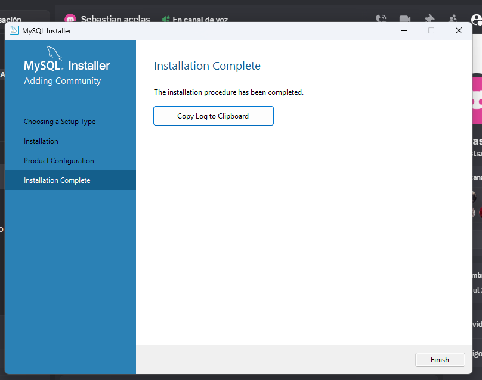
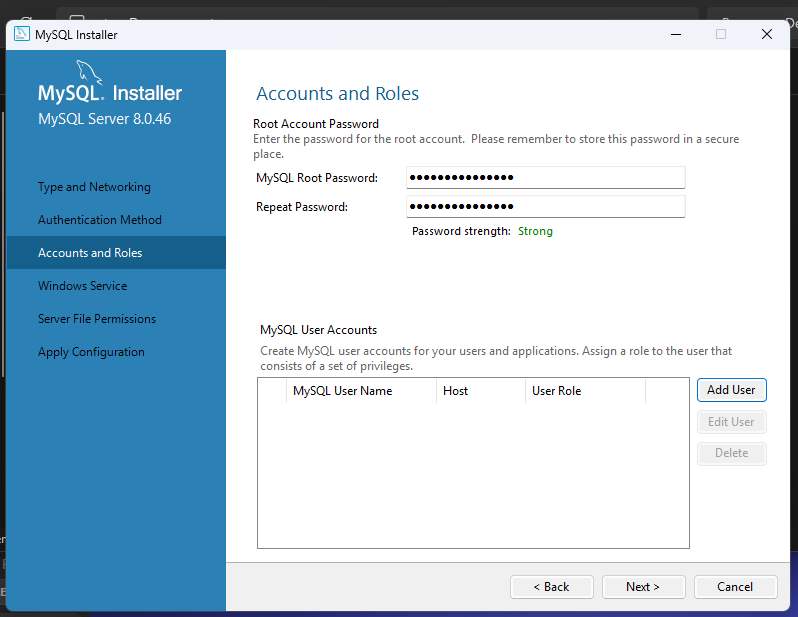
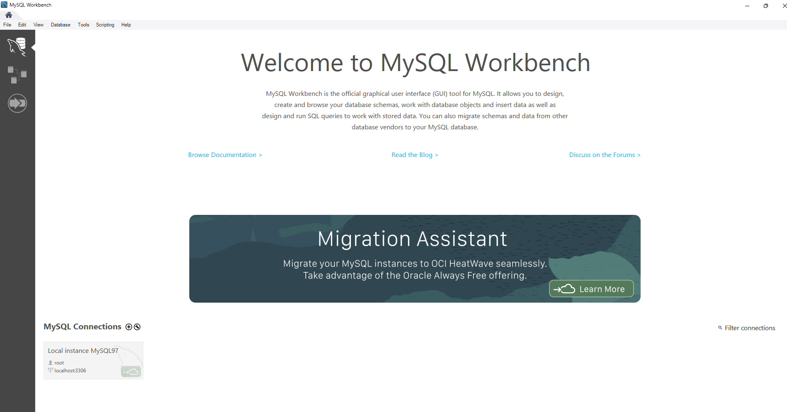
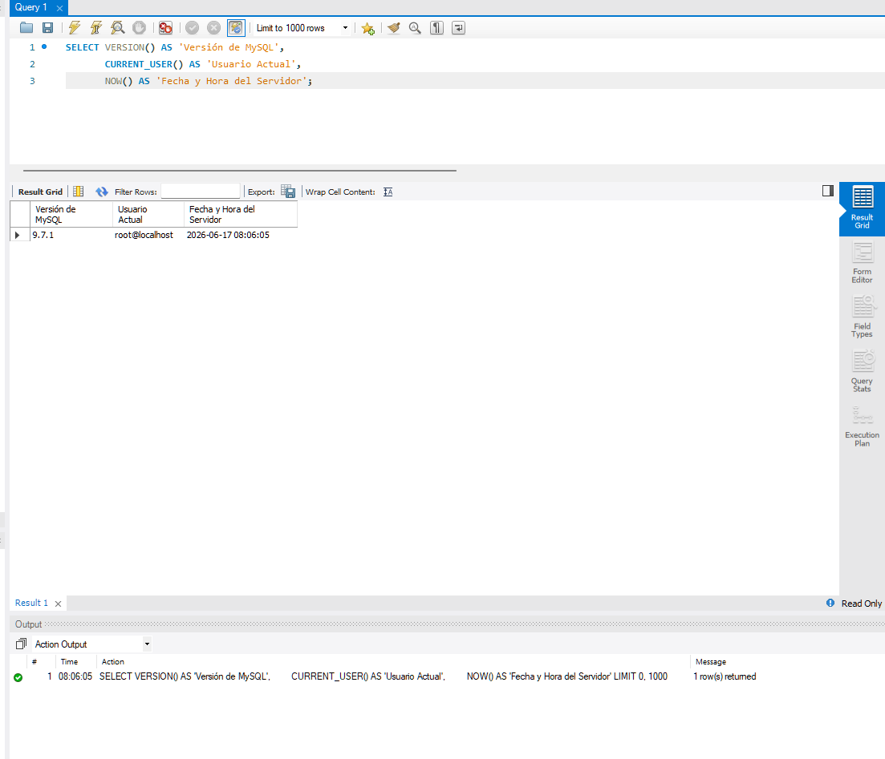

# Instalación y Configuración de MySQL


> Manual de instalación y configuración del entorno de base de datos como parte del proceso de Onboarding técnico. Incluye evidencias gráficas y validación funcional del servidor.

---

## Autor

**Diego Mantilla**
GitHub: [@DMntill4](https://github.com/DMntill4)

---

## Tech Stack


---

## Tabla de Contenidos

- [Autor](#autor)
- [Tech Stack](#tech-stack)
- [Información del Estudiante](#información-del-estudiante)
- [Proceso de Instalación](#proceso-de-instalación)
- [Galería de Evidencias](#galería-de-evidencias)
- [Validación del Entorno](#validación-del-entorno)
- [Estructura del Repositorio](#estructura-del-repositorio)

---

## Información del Estudiante

| Campo | Detalle |
|---|---|
| **Nombre completo** | Diego Mantilla |
| **Sistema Operativo** | Windows 10 / 11 |
| **Actividad** | Instalación de Entorno de Datos y Documentación en GitHub |
| **Herramientas instaladas** | MySQL Server 8.x + MySQL Workbench |

---

## Proceso de Instalación

### 1. Descarga del instalador

Se descargó **MySQL Installer for Windows** desde el sitio oficial:
https://dev.mysql.com/downloads/installer/

Se eligió la versión *mysql-installer-community* (descarga web, más liviana que la versión offline).

### 2. Selección del tipo de instalación

Dentro del asistente (*Setup Type*) se seleccionó la opción **Developer Default**, que incluye automáticamente:

- MySQL Server
- MySQL Workbench
- MySQL Shell
- Documentación y conectores

### 3. Configuración de usuario y contraseña (root)

En el paso de **Accounts and Roles** se definió:

- Método de autenticación recomendado por MySQL.
- Contraseña segura para el usuario `root`.
- (Opcional) Creación de un usuario adicional con rol *DB Admin*.

### 4. Finalización e inicio del servicio

El instalador configuró **MySQL80** como un servicio de Windows con inicio automático. Se verificó en *Servicios* (`services.msc`) que el servicio estuviera en estado **En ejecución**.

### 5. Conexión desde MySQL Workbench

Al abrir MySQL Workbench, el asistente detectó y creó automáticamente la conexión **Local Instance MySQL80**. Se probó la conexión ingresando la contraseña del usuario `root`, confirmando que el servidor respondía correctamente.

---

## Galería de Evidencias

> **Nota:** reemplaza cada imagen colocando tus capturas dentro de la carpeta `/img` con el mismo nombre de archivo (o ajusta la ruta si usas otro nombre).

### Captura 1 — Instalador ejecutándose / Descarga completada



### Captura 2 — Configuración de la contraseña del usuario root



### Captura 3 — MySQL Workbench con la conexión "Local Instance" creada



---

## Validación del Entorno

Para confirmar que la instalación fue exitosa, se ejecutó la siguiente consulta SQL dentro de una pestaña *Query* en MySQL Workbench:

```sql
-- Consulta de validación de entorno
SELECT VERSION() AS 'Versión de MySQL', 
       CURRENT_USER() AS 'Usuario Actual', 
       NOW() AS 'Fecha y Hora del Servidor';
```

La consulta retornó correctamente la versión del servidor, el usuario autenticado y la fecha/hora actual, confirmando que el entorno está **100% funcional**.

### Captura 4 — Resultado de la consulta de validación



---

## Estructura del Repositorio

```
instalacion-mysql/
├── README.md
└── img/
    ├── captura-01-instalador.png
    ├── captura-02-password.png
    ├── captura-03-workbench.png
    └── captura-04-validacion.png
```

---

## Subir las capturas al repositorio (referencia rápida)

```bash
# Clonar el repositorio (si aún no lo tienes localmente)
git clone https://github.com/DMntill4/tu-repositorio.git
cd tu-repositorio

# Crear la carpeta de imágenes y copiar tus capturas allí
mkdir img
# (copia manualmente tus 4 capturas dentro de /img)

# Subir los cambios
git add .
git commit -m "Agrega evidencias de instalación de MySQL"
git push origin main
```

---

## Notas Adicionales

> Espacio opcional para documentar cualquier inconveniente durante la instalación (ej. puerto 3306 ocupado, firewall de Windows, error de conexión) y cómo se resolvió.

- [Tu nota aquí]

---

<p align="center"><i>Entrega correspondiente a la actividad de Onboarding técnico — CampusLands</i></p>